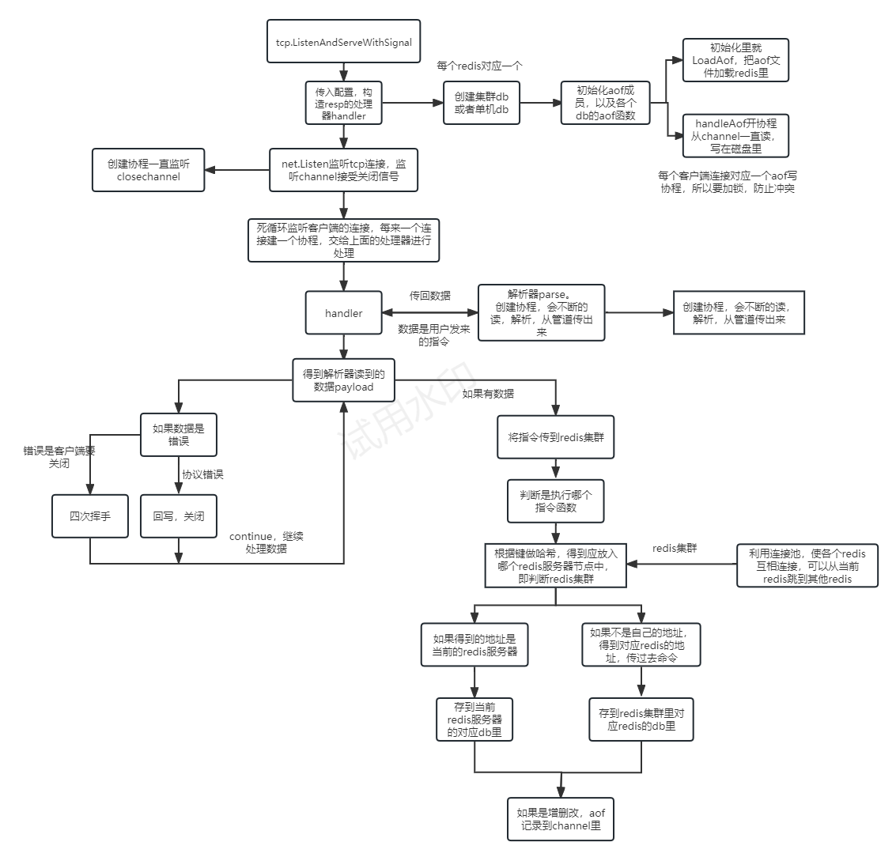

# Golang-Redis


Go-Redis 是用 golang 编写的实现了 RESP（REdis Serialization Protocol）协议的简易 Redis，通过如下的方式实现了 Redis 缓存数据库的大致功能。

项目文件目录安排如下：

``` bash
├─aof           # 持久化
├─cluster       # 集群相关功能,如果开启集群功能则执行这边
│  ├─client_pool# 连接池
│  ├─cluster_database	# 集群数据库
│  ├─com	# 集群结点操作
│  ├─del
│  ├─keys	
│  ├─ping
│  ├─rename	
│  ├─router     # 持久化
│  └─select
├─config        #加载配置文件
├─databese      # 接口定义
│  ├─command    # 指令
│  ├─database   # db
│  ├─echo_database # 测试db
│  ├─keys    
│  ├─ping   
│  ├─standalone_database # 单机redis
│  └─string
├─datastruct	# 底层数据结构实现
│  ├─dict       # 字典
│  ├─list       # list 待实现
│  ├─set        # 待实现
│  └─sertedset  # 待实现
├─interface     # 接口层
│  ├─database   
│  ├─resp       # resp层接口
│  └─tcp        # tcp处理器接口
├─lib           
│  ├─consistenthash  # 一致性哈希
│  ├─logger     # 日志打印
│  ├─sync	    # 同步功能
│  │  ├─atomic  
│  │  └─wait
│  ├─utils	    
│  └─wildcard
├─logs          # 打印的日志文件
├─resp          # resp层解析器
│  ├─client     # 客户端
│  ├─connection # 连接
│  ├─handler    # RESP 协议处理器
│  ├─parser		# RESP 协议解析器
│  └─reply      # 回复，正常，错误，常量
└─tcp	        # TCP服务器
```
项目整体简易流程图如下：

## 使用方法

首先安装依赖：

``` bash
go mod tidy
```

### 服务器端

编译服务器端：

``` bash
go build main.go -o simple-redis
```

配置文件，默认为 `redis.conf`：
``` bash
bind 0.0.0.0
port 6379

appendonly yes
appendfilename appendonly.aof

self 127.0.0.1:6379
peers 127.0.0.1:6380
```
首先是redis服务器的端口和ip的信息，然后是aof是否开启以及aof文件名，
最后是集群的信息，self是自己的地址，peer是集群中其他redis的地址。

集群其他服务器的配置文件与此文件地址相反

## 项目内容

1、用分隔符和 LTV 包解决 TCP 粘包拆包问题，实现了 RESP 协议的 Redis 解析器。

2、利用 Channel 和协程异步编程实现支持 pipeline 模式的客户端。

3、实现 AOF 持久化。可以自动删除过期键。

4、支持 Redis 集群模式。采用一致性 hash 算法实现集群
5、Redis 的常用的五种数据结构节点的定位、获取。
(String,Hash,List,Set,Zset)，并支持相应结构的常用命令

###  1、RESP 协议的 Redis 解析器
RESP 是一个二进制安全的文本协议，工作于 TCP 协议上。RESP 以行作为单位，客户端和服务器发送的命令或数据一律以 \r\n （CRLF）作为换行符。

#### RESP 定义了5种格式
- 简单字符串(Simple String): 服务器用来返回简单的结果，比如"OK"。非二进制安全，且不允许换行。

- 错误信息(Error): 服务器用来返回简单的错误信息，比如"ERR Invalid Synatx"。非二进制安全，且不允许换行。

- 整数(Integer): llen、scard 等命令的返回值, 64位有符号整数

- 字符串(Bulk String): 二进制安全字符串, 比如 get 等命令的返回值

- 数组(Array, 又称 Multi Bulk Strings): Bulk String 数组，客户端发送指令以及 lrange 等命令响应的格式

针对于TCP粘包拆包现象 ，应用层协议通常采用下列几种思路之一来定义消息，以保证完整地进行读取:
- 定长消息
- 在消息尾部添加特殊分隔符，如示例中的Echo协议和FTP控制协议。bufio 标准库会缓存收到的数据直到遇到分隔符才会返回，它可以帮助我们正确地分割字节流。
- 将消息分为 header 和 body, 并在 header 中提供 body 总长度，这种分包方式被称为 LTV(length，type，value) 包。这是应用最广泛的策略，如HTTP协议。当从 header 中获得 body 长度后, io.ReadFull 函数会读取指定长度字节流，从而解析应用层消息。

使用RESP协议，利用分隔符和 LTV 包的结合，解决粘包拆包，对数据进行解析。

**解析器的核心代码在parser.go文件中**

###  2、利用 Channel 和协程异步编程实现支持 pipeline 模式的客户端

利用 Channel 和协程异步编程实现支持 pipeline 模式的客户端。pipeline 模式的 redis 客户端需要有两个后台协程程负责 tcp 通信，
调用方通过 channel 向后台协程发送指令，并阻塞等待直到收到响应，是一个典型的异步编程模式。

**这部分的核心代码在client和resp层的对数据解析的读写协程中**

### 3、实现 AOF 持久化
这部分核心代码在aof.go中
#### AOF 持久化
- 在进行持久化时，get 之类不会改变数据的读命令并不需要进行持久化， 其他指令要在指令完成之后在进行记录。
- 主协程使用 channel 将数据发送到异步协程由异步协程执行持久化操作，每一个客户端连接对应一个aof协程，所以写入aof文件读时候要加锁保证数据的一致性。

[//]: # (#### AOF 重写)

[//]: # (- 暂停AOF写入 -> 更改状态为重写中 -> 准备重写 -> 恢复AOF写入)

[//]: # (- 重写协程读取 AOF 文件中的前一部分（重写开始前的数据，不包括读写过程中写入的数据）并重写到临时文件（tmp.aof）中)

[//]: # (- 暂停AOF写入 -> 将重写过程中产生的新数据写入tmp.aof -> 使用临时文件tmp.aof覆盖AOF文件（使用文件系统的mv命令保证安全 -> 恢复AOF写入)

### 4、支持 Redis 集群模式
集群对客户端是透明的, 可以像使用单机版 redis 一样使用集群

- 利用多台机器建立分布式系统，分工处理提高系统容量和吞吐量。
- 采用一致性 hash 算法将 key 分散到不同的服务器，客户端可以连接到服务集群中任意一个节点。当节点需要访问的数据不在自己本地时，需要通过一致性 hash 算法计算出数据所在的节点并将指令转发给它。
这部分的核心代码主要在consistenthash和com文件中
